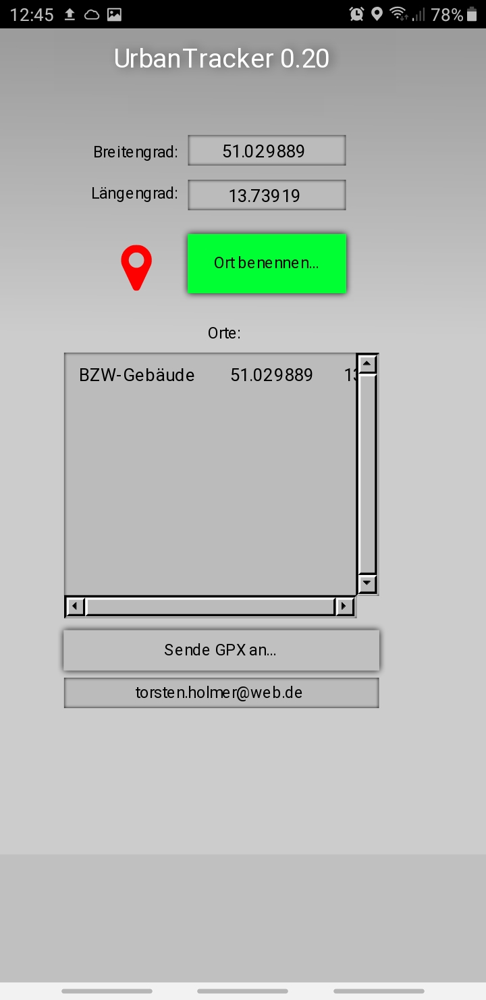

# Data4City_UrbanTracker
Eine App für das Tracken von Wegen und Markieren von Orten in der Stadt

 

Die Datei ist ein Livecode-Stackfile, d.h. sie kann mit der Livecode-IDE geladen und editiert/ausgeführt werden. 
Download der Community-Version von Livecode hier: www.livecode.org

Um sie zu einer Android oder iOS-App zu verwandeln, muss vorher das Java-SDK bzw. XCode installiert und eingerichtet werden.
* http://lessons.livecode.com/m/2571/l/27385-how-do-i-become-an-android-developer-on-a-pc
* http://lessons.livecode.com/m/2571/l/23275-how-do-i-become-an-ios-developer

